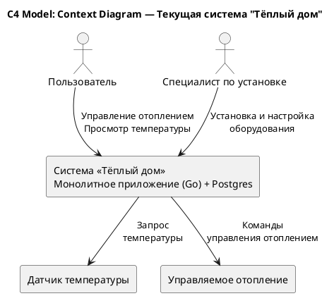
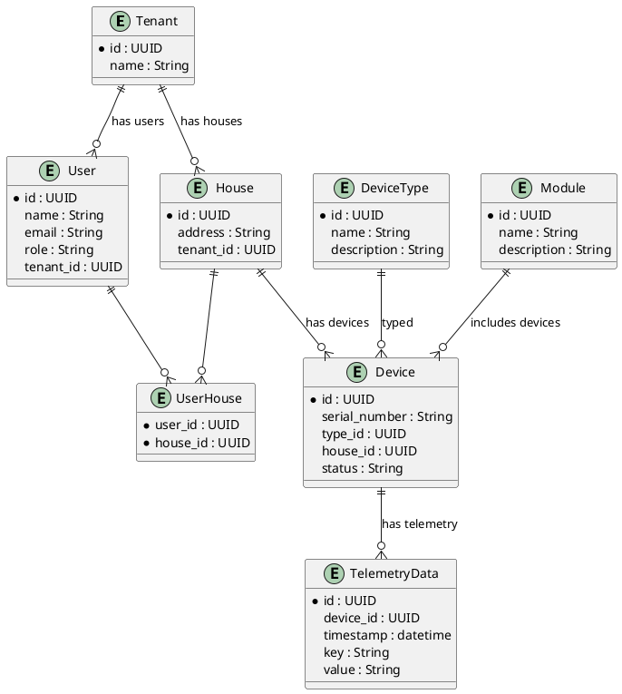

# Sprint 1

# Задание 1. Анализ и планирование

<aside>
- Нынешнее приложение компании позволяет только управлять отоплением в доме и проверять температуру.
- Каждая установка сопровождается выездом специалиста по подключению системы отопления в доме к текущей версии системы.
- Самостоятельно подключить свой датчик к системе пользователь не может.
</aside>

### 1. Описание функциональности монолитного приложения
   
**Управление отоплением:**
	
- Пользователи могут управлять отоплением в доме
- Система поддерживает один тип датчиков.
- Датчики при включении регистрируются, каждая установка сопровождается выездом специалиста.
	
**Мониторинг температуры:**

- Пользователи могут мониторить температуру
- Система поддерживает один тип датчиков, каждая установка сопровождается выездом специалиста.
- Датчики при включении регистрируются, каждая установка сопровождается выездом специалиста.

**Управление системой**
 
- Специалисты организации могут подключать новый дом
- Специалисты организации могут регистрировать новый датчик
- Специалисты организации могут добавлять\редактировать\удалять новых пользователей
- Специалисты организации могут выставлять счета за услуги.
  

### 2. Анализ архитектуры монолитного приложения

- Архитектура приложения представляет из себя монолит на Go с СУБД Postgres.
- Всё синхронно. Никаких асинхронных вызовов, микросервисов и реактивного взаимодействия в системе нет.
- Всё управление идёт от сервера к датчику. Данные о температуре также получаются через запрос от сервера к датчику.


### 3. Определение доменов и границы контекстов


### Core Domain: Управление отоплением

### Контекст 1: Heating Control Context
- **Назначение**: Управление состоянием отопительных устройств.
- **Границы контекста**:
  - Весь бизнес-код, отвечающий за включение/выключение отопления и передачу команд на устройство.
  - Сервер инициирует команды в устройства через синхронные вызовы.
  - Контекст ограничен тем, что работает только с зарегистрированными устройствами.

### Контекст 2: Temperature Monitoring Context
- **Назначение**: Получение текущего значения температуры от устройства.
- **Границы контекста**:
  - Реализует вызовы на устройства для опроса данных о температуре.
  - Не хранит историю данных, работает в режиме "запрос-ответ".
  - Зависит от Heating Control Context (устройство должно быть зарегистрировано в системе).

### Supporting Domain: Подключение оборудования

### Контекст 3: Device Installation & Registration Context
- **Назначение**: Управление процессом подключения оборудования к системе.
- **Границы контекста**:
  - Охватывает всю логику регистрации устройств в системе после физической установки.
  - Полностью завязан на участие инженера компании.
  - Нет возможностей для удалённого/самостоятельного подключения.

### Supporting Domain: Управление пользователями

### Контекст 4: Basic User Management Context
- **Назначение**: Хранение базовой информации о пользователях.
- **Границы контекста**:
  - Отвечает только за учётные записи и их базовую идентификацию в системе.
  - Не включает управление правами доступа, делегирование или группы пользователей.
  - Связан с Device Installation Context для определения "владельца устройства".

### Infrastructure Context

### Контекст 5: Monolithic Application Context
- **Назначение**: Обеспечивает выполнение всех вышеуказанных контекстов в одном приложении.
- **Границы контекста**:
  - Нет физической или логической изоляции контекстов.
  - Все контексты реализованы как части одного монолитного приложения на Go.
  - Единая база данных Postgres содержит схемы и данные для всех контекстов.

---

### Диаграмма контекста (Context diagram) в модели C4

[Core Domain]
├── Heating Control Context (граница: управление командами для отопления)
├── Temperature Monitoring Context (граница: запрос температуры)

[Supporting Domain]
├── Device Installation & Registration Context (граница: регистрация устройства после установки специалистом)
├── Basic User Management Context (граница: базовый учет пользователей без ролей и делегирования)

[Infrastructure]
└── Monolithic Application Context (граница: всё реализовано в едином приложении Go + Postgres, без сервисной изоляции)


---

### PlantUML-описание диаграммы контекста (Context diagram)



### **4. Проблемы монолитного решения**

#### **Узкие места текущего решения**
- Текущее решение плохо масштабируется как по географии клиентов, так и по возможностям подключения новых типов датчиков.
- Затраты на конфигурирование, внедрение и поддержку растут с увеличением клиентской базы и, вероятно, достигнут операционного предела.
- Обновление системы или миграция данных сопровождаются значительными сложностями для клиентов и требуют большого окна простоя (downtime).
- Единая точка входа для API-запросов создает риски для безопасности и доступности системы.
- В целом решение остается хрупким при сбоях оборудования или кибератаках.
- Проблемы с мониторингом, и телеметрией.
 ####  **Нет поддержки:**
- Самостоятельной регистрации пользователей.
- Самостоятельного подключения или настройки устройств.
- Масштабирования под большее количество функций и типов устройств.
- Интеграции с устройствами сторонних производителей.
- Асинхронного или событийного взаимодействия.
- Архитектура не готова к переходу на модель SaaS или самообслуживания.
#### **Достоинства**
- На начальном этапе достаточно небольшой команды
- Более низкие требования к экспертизе команды
- Эффективность решения для небольшой клиентской базы

### 5. Визуализация контекста системы — диаграмма С4

[Core Domain]
  ├── Heating Control Context (граница: управление командами для отопления)
  ├── Temperature Monitoring Context (граница: запрос температуры)

[Supporting Domain]
  ├── Device Installation & Registration Context (граница: регистрация устройства после установки специалистом)
  ├── Basic User Management Context (граница: базовый учет пользователей без ролей и делегирования)

[Infrastructure]
  └── Monolithic Application Context (граница: всё реализовано в едином приложении Go + Postgres, без сервисной изоляции)

**PlantUML-описание диаграммы контекста (Context diagram)**

@startuml
!define RECTANGLE class
!define PERSON actor

title C4 Model: Context Diagram — Текущая система "Тёплый дом"

' Акторы
actor Пользователь as User
actor "Специалист по установке" as Installer

' Система
rectangle "Система «Тёплый дом»\nМонолитное приложение (Go) + Postgres" as System {
}

' Внешние устройства
rectangle "Датчик температуры" as TempSensor
rectangle "Управляемое отопление" as HeatingDevice

' Связи
User --> System : Управление отоплением\nПросмотр температуры
Installer --> System : Установка и настройка\nоборудования

System --> TempSensor : Запрос\nтемпературы
System --> HeatingDevice : Команды\nуправления отоплением
@enduml

### Ключевые характеристики границ контекстов

- Границы "размыты" технически, но при анализе предметной области можно выделить логические контексты:
  - Управление отоплением и мониторинг температуры изолированы концептуально, но не технически.
  - Регистрация устройств и управление пользователями отделены в предметной области, но реализованы как единый код внутри монолита.

- Сильная взаимная связанность:
  - Device Installation Context тесно зависит от User Management и Heating Control.
  - Нет API между контекстами: прямой вызов функций внутри одного приложения.


# Задание 2. Проектирование микросервисной архитектуры

В этом задании вам нужно предоставить только диаграммы в модели C4. Мы не просим вас отдельно описывать получившиеся микросервисы и то, как вы определили взаимодействия между компонентами To-Be системы. Если вы правильно подготовите диаграммы C4, они и так это покажут.


# Ключевые особенности целевой системы

- **SaaS / Self-service модель**: клиент сам выбирает устройства и модули, настраивает сценарии и управляет ими.
- **Открытая экосистема**: поддержка устройств сторонних производителей по стандартным протоколам.
- **Модульность**: покупка и настройка модулей как "конструктор".
- **Удаленный доступ** и управление через интернет.
- **Возможность расширения сценариев на будущее**.

  **Не смотря на Self-service модель, нам все равно потребуется проработка вопроса системных требований для датчиков и устройст типа hub.**
  

## Ключевые микросервисы

### Core Services
- **Device Management Service**: Управление устройствами — регистрация, удаление, конфигурация.
- **Module Control Service**: Управление модулями дома:
  - Освещение
  - Отопление
  - Ворота
  - Видеонаблюдение
- **Automation & Scenario Service**: Пользовательские сценарии и автоматизация.

### Supporting Services
- **Telemetry Service**: Сбор телеметрии с устройств и хранение истории.
- **User & Access Management Service**: Управление пользователями, ролями и правами доступа.

### SaaS Platform Services
- **Tenant Management Service**: Управление tenant-ами (организациями/пользователями).
- **Module Catalog Service**: Каталог доступных модулей и поддерживаемых устройств.
- **Subscription & Billing Service**: Подписки и тарификация.

### Integration Services
- **Integration Gateway (Kafka?)**: Интеграция с внешними API и сервисами.

## Взаимодействия

- Все сервисы атомарно владеют своими данными ("Database per Service"):
  - Нет общей базы данных между сервисами.
  - Каждый сервис использует свою схему в БД или даже разные типы БД при необходимости.

- Тип взаимодействия между сервисами:
  - Синхронное взаимодействие через REST (например, при вызовах из API Gateway).
  - Асинхронное взаимодействие через Event Bus (например, события о регистрации устройств, смене статуса и т.д.).

---


# C4: Уровень контейнеров (Containers Diagram)

```
[API Gateway]
     |
+----------------------------+
|        Микросервисы        |
+----------------------------+
| Device Management Service  |
| Module Control Service     |
| Automation & Scenario Svc  |
| Telemetry Service          |
| User & Access Mgmt Service |
| Tenant Management Service  |
| Module Catalog Service     |
| Subscription & Billing Svc |
| Integration Gateway        |
+----------------------------+
     |
[Event Bus (Kafka/RabbitMQ)]
     |
[Базы данных каждого сервиса]
```

---

# Уровень компонентов (Components Diagram)

Пример для **Device Management Service**:

```
Device Management Service
├── API Component
│     REST/gRPC интерфейс для внешних клиентов.
├── Command Handler
│     Обработка команд регистрации, конфигурации устройств.
├── Device State Manager
│     Управление состоянием устройств, коммуникация с физическими устройствами.
├── Repository
│     Доступ к собственной базе данных устройств.
```

---

# Уровень кода (Code Diagram)

Для **Device State Manager** (класс управления состоянием устройств):

```
+------------------------+
| DeviceStateManager     |
+------------------------+
| - repository           |
| - protocolAdapter      |
+------------------------+
| + registerDevice()     |
| + updateDeviceState()  |
| + getDeviceStatus()    |
| + removeDevice()       |
+------------------------+

DeviceStateManager --> Repository : uses
DeviceStateManager --> ProtocolAdapter : delegates communication
```

---

# Сводка по микросервисам

| 🧱 Микросервис | 📋 Основная ответственность |
| -------------- | ---------------------------- |
| Device Management | Регистрация/управление устройствами |
| Module Control | Управление модулями (свет, отопление) |
| Automation & Scenario | Конструктор сценариев |
| Telemetry | Хранение истории телеметрии |
| User & Access Mgmt | Пользователи и роли |
| Tenant Mgmt | Tenant-ы (организации/пользователи) |
| Module Catalog | Каталог модулей и поддерживаемых устройств |
| Subscription & Billing | Управление подписками и оплатой |
| Integration Gateway | Интеграция с внешними сервисами |

---

# C4 Model: Уровень контейнеров (Container Diagram)

```plantuml
@startuml
!include https://raw.githubusercontent.com/plantuml-stdlib/C4-PlantUML/master/C4_Container.puml

Person(user, "Пользователь", "Управляет своим умным домом через SaaS")

System_Boundary(s1, "Экосистема «Тёплый дом»") {
    Container(api_gateway, "API Gateway", "Nginx / Kong", "Единая точка входа для клиентов")
    Container(device_mgmt, "Device Management Service", "Go", "Управление регистрацией и состоянием устройств")
    Container(module_control, "Module Control Service", "Go", "Управление модулями: отопление, свет и др.")
    Container(automation, "Automation & Scenario Service", "Go", "Пользовательские сценарии и автоматизация")
    Container(telemetry, "Telemetry Service", "Go", "Сбор и хранение телеметрии")
    Container(user_access, "User & Access Management Service", "Go", "Управление пользователями и правами")
    Container(tenant_mgmt, "Tenant Management Service", "Go", "Управление tenant-ами")
    Container(module_catalog, "Module Catalog Service", "Go", "Каталог доступных модулей и устройств")
    Container(billing, "Subscription & Billing Service", "Go", "Управление подписками и оплатой")
    Container(integration, "Integration Gateway", "Go", "Интеграция с внешними сервисами")
    ContainerDb(db_device, "Device DB", "PostgreSQL", "БД для Device Management Service")
    ContainerDb(db_telemetry, "Telemetry DB", "TimescaleDB", "БД для хранения телеметрии")
    ContainerDb(db_user, "User DB", "PostgreSQL", "БД для User & Access Management")
    Container(event_bus, "Event Bus", "Kafka/RabbitMQ", "Асинхронное взаимодействие")
}

Rel(user, api_gateway, "Использует", "HTTPS")
Rel(api_gateway, device_mgmt, "REST/gRPC")
Rel(api_gateway, module_control, "REST/gRPC")
Rel(api_gateway, automation, "REST/gRPC")
Rel(api_gateway, telemetry, "REST/gRPC")
Rel(api_gateway, user_access, "REST/gRPC")
Rel(api_gateway, tenant_mgmt, "REST/gRPC")
Rel(api_gateway, module_catalog, "REST/gRPC")
Rel(api_gateway, billing, "REST/gRPC")

Rel(device_mgmt, db_device, "Использует", "SQL")
Rel(telemetry, db_telemetry, "Использует", "SQL")
Rel(user_access, db_user, "Использует", "SQL")

Rel(device_mgmt, event_bus, "Публикует/Подписывается")
Rel(automation, event_bus, "Публикует/Подписывается")
Rel(module_control, event_bus, "Публикует/Подписывается")
@enduml
```


### PlantUML — C4 Model: Уровень компонентов (Component Diagram) для Device Management Service

@startuml
!include https://raw.githubusercontent.com/plantuml-stdlib/C4-PlantUML/master/C4_Component.puml

Container(device_mgmt, "Device Management Service", "Go", "Управление устройствами")

Component(api, "API Component", "REST API", "Точка входа для вызовов управления устройствами")
Component(cmd_handler, "Command Handler", "Go", "Обработка команд регистрации/конфигурации")
Component(state_mgr, "Device State Manager", "Go", "Управление состоянием устройств")
Component(repo, "Device Repository", "SQL Repository", "Доступ к данным об устройствах")

Rel(api, cmd_handler, "Вызывает")
Rel(cmd_handler, state_mgr, "Вызывает")
Rel(state_mgr, repo, "Читает/пишет")
@enduml
###PlantUML — C4 Model: Уровень кода (Code Diagram) для Device State Manager
@startuml
class DeviceStateManager {
  - repository: DeviceRepository
  - protocolAdapter: ProtocolAdapter
  + registerDevice(deviceInfo)
  + updateDeviceState(deviceId, state)
  + getDeviceStatus(deviceId)
  + removeDevice(deviceId)
}

class DeviceRepository {
  + save(device)
  + findById(deviceId)
  + delete(deviceId)
}

class ProtocolAdapter {
  + sendCommand(deviceId, command)
  + queryStatus(deviceId)
}

DeviceStateManager --> DeviceRepository : uses
DeviceStateManager --> ProtocolAdapter : delegates communication
@enduml


# Задание 3. Разработка ER-диаграммы

## Ключевые сущности и их атрибуты

### Пользователь (User)
- `id`: UUID
- `name`: String
- `email`: String
- `role`: String
- `tenant_id`: UUID (FK → Tenant)

### Tenant
- `id`: UUID
- `name`: String

### Дом (House)
- `id`: UUID
- `address`: String
- `tenant_id`: UUID (FK → Tenant)

### Устройство (Device)
- `id`: UUID
- `serial_number`: String
- `type_id`: UUID (FK → DeviceType)
- `house_id`: UUID (FK → House)
- `status`: String (например: online, offline, enabled, disabled)

### Тип устройства (DeviceType)
- `id`: UUID
- `name`: String
- `description`: String

### Модуль (Module)
- `id`: UUID
- `name`: String
- `description`: String

### Телеметрия (TelemetryData)
- `id`: UUID
- `device_id`: UUID (FK → Device)
- `timestamp`: datetime
- `key`: String
- `value`: String

---

## Связи между сущностями

- **Tenant — User**: один Tenant может иметь много Users.
- **Tenant — House**: один Tenant владеет многими Houses.
- **User — House**: многие пользователи могут быть связаны с одним House (многие-ко-многим; например, владелец + гости).
- **House — Device**: один House содержит много Devices.
- **Device — DeviceType**: многие Devices могут быть одного DeviceType.
- **Device — TelemetryData**: одно Device может иметь много TelemetryData.
- **Device — Module**: многие Devices могут принадлежать одному Module (например, "Отопление").

---

## ER-диаграмма в PlantUML



